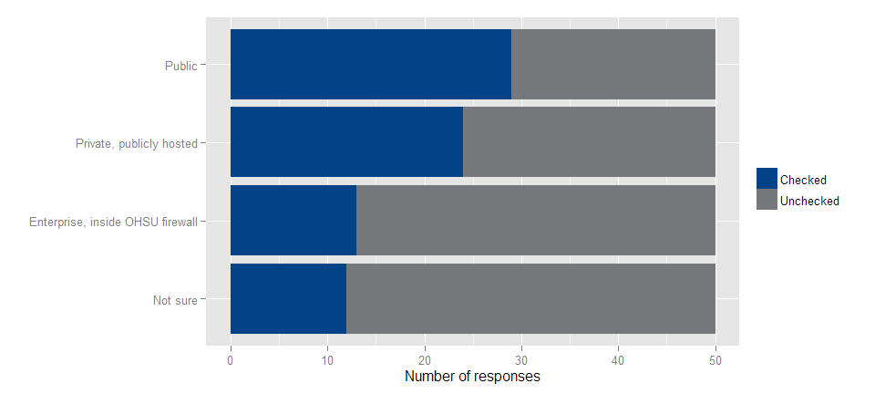

# Results from the Code Sharing Survey
| Benjamin Chan (chanb@ohsu.edu)
| Center for Health Systems Effectiveness
  
September 25, 2015  

## Tidy data

* [SurveyMonkey](https://www.surveymonkey.com) data file was downloaded on 9/17/2015

* Unzip the downloaded file

* Read CSV file into R version 3.2.1 (2015-06-18)

* Factorize some responses

* Recode *check all that apply* responses from character to integer

* Reshaped data table from wide to long

* Add `question` string

* Factorize `variable`

* See the code [here](makeSlides.Rmd)

## How much interest do you have in a common OHSU repository for code?

 

## Do you use any of the following code sharing platforms?

 

## To get specific, are you a Github user?

 

## With which level(s) of security in code-sharing would you be comfortable?

 

## If OHSU were to set up a code base comprising Github repositories with appropriate security, how likely would you be to use it?

 

## Are you interested in further discussion of code sharing at OHSU?

 

## Please share any concerns you've had with code sharing

1. Code sharing is great, however, there will be no one size fits all solution.  Some people need to keep their code private for IP or security reasons, others will want to share with others at OHSU only and still others will want to share publicly.  I work on code that falls into each of these categories.  Repo support is an issue too.  A few clinical systems may need 24x7 up time of the version control system.  In other words there has to be someone to call in the night if the code repository goes down and is needed to solve a production issue.
1. When analysts don't share code, the formation of common practices suffers.  Efficiency is reduced as each analyst writes new code for the same task.  Worst, collaborators get inconsistent results at a basic level as data are processed multiple ways.
1. no concerns so far
1. N/A
1. I have no concerns with code sharing, when data and code properly is spearated. but I wonder if ohsu intelectual propery practice and code sharing is conflicting.

## Any concerns...

1. No concerns yet, but I do worry that if OHSU were to come up with a more structured approach to code sharing, it would introduce bureaucracy and barriers to our existing workflows.
1. PHI
1. takes time
1. I have and do induct a lot of novices into scripting and basic informatics.  A lot of my co-workers and collaborators are not themselves computational scientists, but need access to the tools.  I would encourage that whatever platform is used for sharing, be transparent and readily adoptable even for people with non-computational backgrounds.

## Any concerns...

1. We work with data that may contain PHI and/or data we are custodians of (not owners). Therefore, we need a system that allows for code sharing (among authorized individuals) while protecting our organization from unintentional release of data.
1. Since I am a biostatistician, I'm not sure how much of the shared code would be relevant to me (or how useful others would find my code).
1. The guidelines that OHSU stipulates regarding IP and the use of cloud services is troubling. Additionally we must protect against exposure of credentials and need to have established review process in place.
1. Keeping human data/propietary data private, sometimes the code is revealing about that or we can't keep the data on a repo so the code can't be run without making dummy datasets. Also keeping code in a shareable state is time consuming.

## What are some things you'd like to learn about Github?

1. How people are using it at OHSU, specifically in research.
1. I'd like to learn how to make my code easy to use and adopt, and how to get the best getting-started instructions from diverse repos.
1. Used git and github a few times, it seem quite complicated to use.
1. How to sync and upload into the repositories. 
1. I just started using it for a Coursera course and could use basic help on how it works.

## Some things you'd like to learn... ?

1. I upload code to github that is standalone with simulated data. If i have real data, that is protected and private, how can I seamlessly upload and download code from github on various computers while keeping the data in one private place? Also is there version control for data sets through github? Others I believe would like to know how to use github for SAS, maybe through the desktop app? Also github through RStudio is quite easy and good for beginners.
1. How it fits into OHSU's guidelines related to cloud services.
1. N/A
1. how to organize multiple projects

## Some things you'd like to learn... ?

1. how to work on a projects with more then one developer? particularely: forking, pull request, documentation.
1. Non-public options
1. I already know about Github and like it.  Git + attlassian stash (or similar) might work in some scenarios too.
1. everything

## List the OHSU departments, centers and institutes of which you know that house experienced computational scientists

1. Center for Spoken Language Understanding; the Computer Science and Electrical Engineering grad program; the Informatics Discovery Lab; DMICE in general; etc.
1. Department of Medical Informatics & Clinical Epidemiology
1. Dept of Medical Informatics and Epidemiology(DMICE), Bioinformatics, Biostatistics, OCTRI
1. OCSSB, CBP, Knight IRS, DMICE, theoretical & computational neuroscience 
1. BDP, School of Nursing Stat Core

## List the OHSU departments...

1. DMICE, Computational Biology, Sequencing core
1. Computational biology, biostatistics, quantitative biomedicine and bioengineering, OCHSER, SoM, ohsu library, center for speech and hearing, ob/gyn, knight bioinformatics core, oregon national primate center bioinformatics core, dmice
1. Public Health biostat and epi, DMICE, OCTRI BDP (soon part of Public Health?), Primate center including Lucia Carbone's lab, Knight Cancer biostat and bioinformatics, Family Medicine and OCHIN, IGL, Center for Health Systems Effectiveness, Knight Cardiovascular Institute, the bioinformatics support for Soren Impey's lab, Paul Spellman's lab, other labs that do 'omics, proteomics core
1. I'm not sure exactly how to define computational scientist...

## List the OHSU departments...

1. Paul Spellman's group, Shannon McWeeney's group, DMICE students, Lucia Carbone's core at ONPRC, a few more folks at ONPRC, all the new people under Adam--aren't most people on the exacloud mailing list by now?
1. I have been to the Data Jamborees am pretty familiar with the major departments but am under the impression there are also some folks hidden here and there.
1. OCTRI BMIP, ITG UAMD, Dr. Damien Fair Neuro Imaging, DMICE, ACC
1. NA
